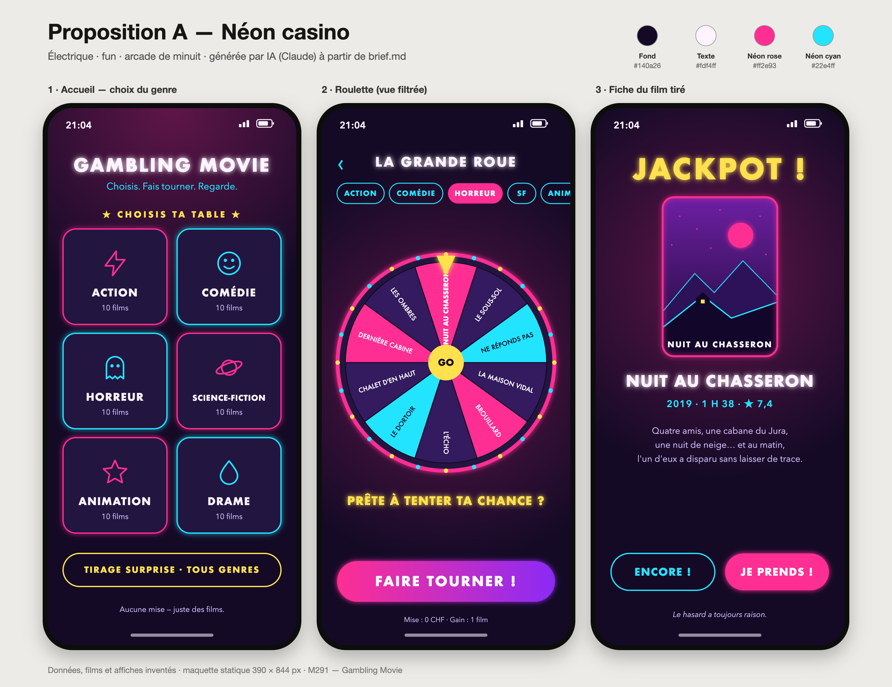
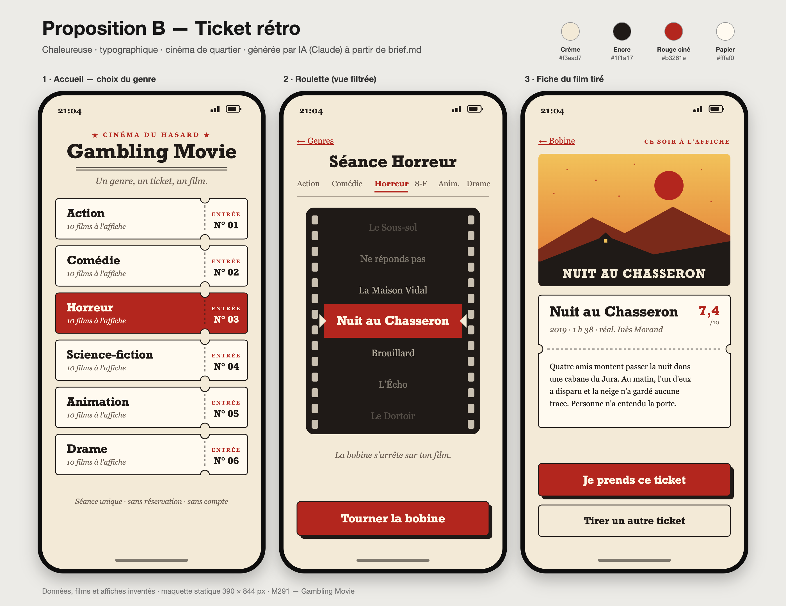
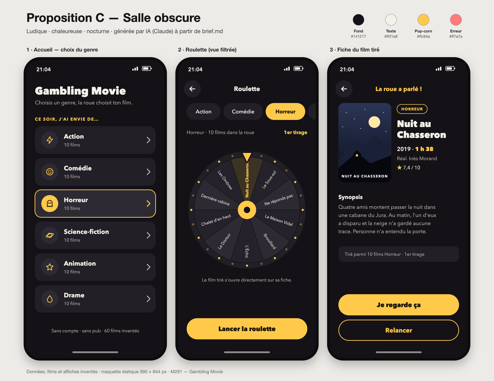

# Critique comparative des propositions de design — Gambling Movie

Les trois propositions ont été générées avec une IA (Claude, d'Anthropic) à partir de [`brief.md`](../../brief.md), du [persona](persona.md) et des [wireframes](wireframes/). Elles reprennent les mêmes 3 écrans (accueil, roulette, fiche du film) avec trois directions artistiques très différentes. Les films et les affiches sont inventés.

**Consigne donnée à l'IA (résumé) :** « À partir de ce brief, de ce persona et de ces wireframes, propose trois directions artistiques nettement différentes pour les 3 écrans mobiles (390 × 844 px) de Gambling Movie. Même contenu, même structure ; change la palette, la typographie, les formes et le ton. »

| | Fichier |
| --- | --- |
| A — Néon casino | [`propositions/proposition-a-neon-casino.png`](propositions/proposition-a-neon-casino.png) |
| B — Ticket rétro | [`propositions/proposition-b-ticket-retro.png`](propositions/proposition-b-ticket-retro.png) |
| C — Salle obscure | [`propositions/proposition-c-salle-obscure.png`](propositions/proposition-c-salle-obscure.png) |

## Grille de critères (note sur 5)

| Critère | A · Néon casino | B · Ticket rétro | C · Salle obscure |
| --- | :---: | :---: | :---: |
| Lisibilité et contraste WCAG AA | 2 | 4 | 5 |
| Adapté à Léa (le soir, dans le noir) | 3 | 1 | 5 |
| Cibles tactiles ≥ 48 px, zone du pouce | 2 | 3 | 5 |
| Respect des interdits du brief | 1 | 5 | 5 |
| Fidélité aux wireframes et au MVP | 3 | 4 | 5 |
| Originalité, personnalité | 5 | 5 | 3 |
| Faisabilité en HTML/CSS vanilla en 4 semaines | 2 | 3 | 5 |
| **Total / 35** | **18** | **25** | **33** |

Contrastes calculés avec la formule WCAG 2.x (luminance relative) sur les couleurs exactes des maquettes :

| Couple texte / fond | A | B | C |
| --- | :---: | :---: | :---: |
| Texte principal / fond | 17,8:1 | 14,4:1 | 16,5:1 |
| Texte secondaire / fond | 10,6:1 | 5,2:1 | 8,8:1 |
| Texte du bouton principal / bouton | **3,5:1** ✗ | 6,1:1 | 11,9:1 |
| Accent / fond | 12,4:1 (cyan) | 5,5:1 (rouge) | 12,1:1 (jaune) |

## A — Néon casino

**Points forts**
- La plus fun et la plus mémorable : on a vraiment envie de faire tourner la roue.
- Fond sombre, cohérent avec un usage le soir.
- La grille 2 × 3 de genres avec icônes se lit très vite.

**Points faibles**
- Contredit le brief : « JACKPOT ! », « Prête à tenter ta chance ? », « Choisis ta table », « Mise : 0 CHF ». C'est exactement le vocabulaire de jeu d'argent que les interdits excluent.
- Texte blanc sur rose à 3,5:1 (bouton « Je prends ! », puce active, tranches roses de la roue) : en dessous du minimum AA de 4,5:1.
- Les halos lumineux rendent les lettres floues et fatiguent les yeux dans le noir.
- Puces de genre de 32 px et bouton retour « ‹ » minuscule : cibles trop petites pour le pouce.
- Le réalisateur a disparu de la fiche et le synopsis est centré, donc plus difficile à lire.
- Ajoute un « Tirage surprise » qui n'est pas dans le MVP.
- Les nombreux `box-shadow` et `filter` risquent de faire saccader un téléphone d'entrée de gamme.

## B — Ticket rétro

**Points forts**
- Très original : les genres deviennent des tickets numérotés, la roue devient une bobine de film. L'idée colle parfaitement au thème du cinéma.
- Tous les contrastes passent le niveau AA.
- Aucun vocabulaire de jeu d'argent : on « tire un ticket ».
- La fiche « ticket » avec perforation sépare bien les infos du synopsis.

**Points faibles**
- Fond crème clair : à 22 h dans le noir, c'est l'écran blanc qui éblouit Léa, l'une des raisons pour lesquelles elle ferme l'onglet.
- Les onglets de genre sont du texte simple (≈ 20 px de haut) avec des abréviations (« S-F », « Anim. ») : petits et moins clairs.
- Les liens retour soulignés sont petits et placés en haut, loin du pouce.
- Typo serif en italique de 13–14 px : charmante, mais moins lisible sur un petit écran.
- Les tickets à encoches et les perforations demandent du `mask` ou du `clip-path` : plus long à coder proprement.

## C — Salle obscure

**Points forts**
- Pensée pour le contexte réel de Léa : fond anthracite, un seul accent chaud (jaune pop-corn), rien qui éblouit.
- Les meilleurs contrastes des trois : bouton principal à 11,9:1, texte secondaire à 8,8:1.
- Cibles confortables : puces de 48 px, boutons pilule de 60 px placés en bas, dans la zone du pouce.
- La durée « 1 h 38 » est mise en avant en jaune : l'info clé pour Léa est visible au premier coup d'œil.
- Reprend fidèlement les 3 wireframes, sans fonction ajoutée.
- Simple à coder : aplats, `border-radius`, roue faisable en `conic-gradient`, une variable CSS par couleur.

**Points faibles**
- Plus sage que A et B : sans la roue, on pourrait la confondre avec une app de streaming.
- Les titres sur les tranches de la roue sont petits (11,5 px).
- La puce active se distingue surtout par la couleur.

## Choix final : proposition C — Salle obscure

C'est la seule proposition qui respecte en même temps le persona, le brief et l'accessibilité :
- Léa l'utilise le soir dans le noir, et C est la seule à ne pas l'éblouir sans fatiguer ses yeux.
- Elle tient son téléphone d'une main, et C a toutes ses actions dans la moitié basse, avec des cibles ≥ 48 px.
- C ne contient aucun vocabulaire de casino, tous ses contrastes dépassent 4,5:1 et elle est réaliste à coder en 4 semaines.

A est la plus amusante, mais elle trahit les interdits du brief. B est la plus originale, mais son fond clair va contre le premier fait utile du persona.

### Ce qu'on emprunte aux autres propositions

- **De B :** l'esprit « ticket » pour l'écran de confirmation « C'est validé ! ». Une carte à encoches sur ce seul écran donne un petit moment de plaisir pour un coût limité.
- **De A :** une légère lueur jaune sur le pointeur de la roue, seulement pendant l'animation. Elle est désactivée avec `prefers-reduced-motion`.
- **On rejette :** le vocabulaire de jeu d'argent, les néons partout et le fond clair.

### Direction artistique retenue

> **« Le noir de la salle, la lumière du projecteur. »**
> Ludique, chaleureuse, nocturne : l'écran est sombre comme une salle de cinéma, et seul ce qui compte s'allume en jaune pop-corn.

| Rôle | Couleur provisoire (hex à confirmer en s7-s9) |
| --- | --- |
| Fond | `#141217` (anthracite chaud) |
| Surface (cartes) | `#221f26`, surface active `#2e2a33` |
| Texte | `#f5f1e8` (blanc cassé) |
| Texte secondaire | `#b9b1a6` |
| Accent | `#ffc94a` (jaune pop-corn), texte sur accent `#1a1408` |
| Erreur | `#ff7a7a` (rouge cerise clair) |

- **Typographie :** une seule famille sans serif (`system-ui`), titres en 800, corps de texte en 15–16 px minimum.
- **Formes :** cartes arrondies (18 px), boutons pilule de 60 px, puces de 48 px.
- **Mouvement :** la roue tourne 2,5 s maximum avec un ralentissement final ; avec `prefers-reduced-motion`, pas d'animation.

### Corrections à apporter à C avant de coder

1. Puce active : ajouter un indicateur autre que la couleur (contour + texte en gras ou ✓), conformément au critère WCAG 1.4.1.
2. Roue : afficher le titre du film tiré en grand sous la roue et l'annoncer avec `aria-live`, car les titres des tranches sont petits.
3. Affiche : garder un bandeau ou une ombre sous le titre écrit sur l'image pour qu'il reste lisible quelle que soit l'affiche.
4. Vérifier que la roue tient sur un écran de 360 px de large, en la réduisant si nécessaire.
