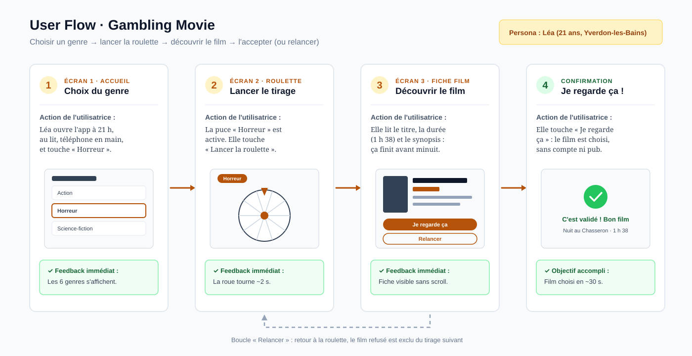

# User flow — tâche principale

**Tâche :** laisser l'app choisir le film de la soirée dans un genre donné, puis l'accepter ou relancer.

**Début :** la personne ouvre Gambling Movie sur son téléphone et arrive sur l'écran d'accueil (liste des genres).  
**Fin réussie :** la personne a validé un film tiré au sort (« Je regarde ça ») et voit une confirmation avec le titre et la durée du film.

**Persona :** Léa, 21 ans (voir [persona.md](persona.md)) · **Écrans traversés :** Accueil → Roulette → Fiche film → Confirmation · **Durée visée :** moins de 60 secondes

## Chemin

1. **Écran 1 — Accueil (choix du genre)**  
   *Action :* Léa ouvre l'app à 21 h depuis son téléphone.  
   *Feedback attendu :* les 6 genres s'affichent tout de suite en cartes (nom + « 10 films »), sans compte, sans pop-up.
2. **Écran 1 → Écran 2**  
   *Action :* elle touche la carte « Horreur ».  
   *Feedback attendu :* la carte s'allume (état actif) puis l'écran Roulette s'ouvre ; la puce « Horreur » est active en haut et la roue affiche les 10 films du genre.
3. **Écran 2 — Roulette (vue filtrée)**  
   *Action :* elle touche le gros bouton « Lancer la roulette », en bas de l'écran.  
   *Feedback attendu :* la roue tourne environ 2 secondes, ralentit et s'arrête sur un film. Pendant le tirage, le bouton affiche « La roue tourne… » et ne réagit plus (pas de double tirage).
4. **Écran 3 — Fiche du film tiré**  
   *Action :* elle lit la fiche : affiche, titre, année, durée, réalisateur, note, synopsis.  
   *Feedback attendu :* tout est visible sans scroller ; la durée est écrite en toutes lettres (« 1 h 38 »). Deux boutons en bas : « Je regarde ça » (principal) et « Relancer » (secondaire).
5. **Écran 3 → Confirmation**  
   *Action :* le film lui plaît, elle touche « Je regarde ça ».  
   *Feedback attendu :* message de confirmation « C'est validé ! Nuit au Chasseron · 1 h 38 · Bon film 🍿 », avec un lien « Nouveau tirage » pour revenir à l'accueil.

**Boucle « Relancer » :** à l'étape 4, si le film ne lui plaît pas, Léa touche « Relancer » → retour à l'écran 2, la roue relance automatiquement et le film refusé est exclu du tirage suivant (compteur « 2ᵉ tirage »).

## Variante d'échec (optionnel)

- **Les films ne se chargent pas** (fichier JSON introuvable) → l'écran dit : « Impossible de charger les films. Vérifie ta connexion, puis réessaie. » + bouton « Réessayer ».
- **Tous les films du genre ont été refusés** → l'écran dit : « Tu as fait le tour des 10 films Horreur ! Choisis un autre genre ou recommence. » + boutons « Changer de genre » et « Tout remettre dans la roue ».
